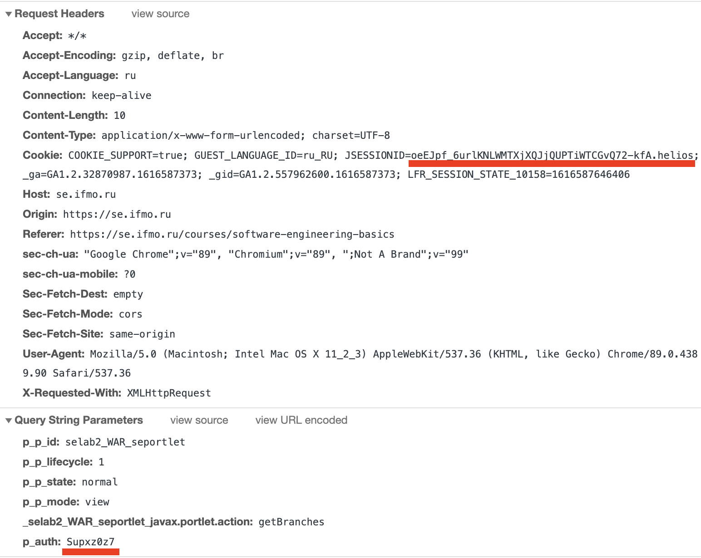

# software_engineering_basics_lab2_solver

## Installation

```shell
git clone https://github.com/foryourselfand/software_engineering_basics_lab2_solver.git
python3 -m venv venv_python3 # tested on python3.7, but should work on >= python3.6
source venv_python3/bin/activate
# venv_python3\Scripts\activate.bat # Windows
pip install -r requirements.txt
```

## Usage

```shell
python3 solver.py --help

#usage: solver.py [-h] -v VARIANT -j JSESSIONID -p P_AUTH
#
#optional arguments:
#  -h, --help            show this help message and exit
#
#required named arguments:
#  -v VARIANT, --variant VARIANT
#                        variant number
#  -j JSESSIONID, --jsessionid JSESSIONID
#                        JSESSIONID from cookies
#  -p P_AUTH, --p_auth P_AUTH
#                        p_auth from params
```

## Examples

```shell
python3 solver.py --variant 134538 --jsessionid YcuD-TUVDbhlPjafeoIjO1RA1xlsgXAtiz_JxgAh.helios --p_auth HkW6wAwA
python3 solver.py --p_auth Supxz0z7 --jsessionid oeEJpf_6urlKNLWMTXjXQJjQUPTiWTCGvQ72-kfA.helios --variant 331039
# don't change jsessionid and p_auth every time, only if needed (stopped working, so needs update)  
```

## Results

Directory `res/{variant}/` contains `solution_git.sh`, `solution_svn.sh` and directories `commits/` and `zips/`

## JSESSIONID? p_auth?

* go to https://se.ifmo.ru/courses/software-engineering-basics
* open network window in browser
* type variant and press enter
  
* choose response starting as 'software-engineering-basics'
* With curl_helper.py
    * 
    * right click on request -> Copy -> Copy as cURL
    * `python3 curl_helper.py ... # ... = cURL you just copied`
        * example `python3 curl_helper.py curl 'https://se.ifmo.ru/courses/software-engineering-basics?p_p_id=selab2_WAR_seportlet&p_p_lifecycle=1&p_p_state=normal&p_p_mode=view&_selab2_WAR_seportlet_javax.portlet.action=getBranches&p_auth=bOtQHW4a' \ -H 'Connection: keep-alive' \ -H 'sec-ch-ua: "Google Chrome;v=89," Chromium;v=89, ";Not A Brand;v=99'" \ -H 'Accept: */*' \ -H 'X-Requested-With: XMLHttpRequest' \ -H 'sec-ch-ua-mobile: ?0' \ -H 'User-Agent: Mozilla/5.0 (Macintosh; Intel Mac OS X 11_2_3) AppleWebKit/537.36 (KHTML, like Gecko) Chrome/89.0.4389.114 Safari/537.36' \ -H 'Content-Type: application/x-www-form-urlencoded; charset=UTF-8' \ -H 'Origin: https://se.ifmo.ru' \ -H 'Sec-Fetch-Site: same-origin' \ -H 'Sec-Fetch-Mode: cors' \ -H 'Sec-Fetch-Dest: empty' \ -H 'Referer: https://se.ifmo.ru/courses/software-engineering-basics' \ -H 'Accept-Language: ru' \ -H 'Cookie: COOKIE_SUPPORT=true; GUEST_LANGUAGE_ID=ru_RU; JSESSIONID=Ndr0kN6mUMPley4scndljq6FmaSRFVUidz8Be2Uu.helios; _ga=GA1.2.1103124463.1617830708; _gid=GA1.2.412959988.1617830708; _gat=1; LFR_SESSION_STATE_10158=1617831174694' \ --data-raw 'variant=1' \ --compressed`
        * output result `--jsessionid Ndr0kN6mUMPley4scndljq6FmaSRFVUidz8Be2Uu.helios --p_auth bOtQHW4a`
* Manually
    * open headers window
    * find and copy JSESSIONID from Cookie at Request Headers and p_auth from Query String Parameters
      
