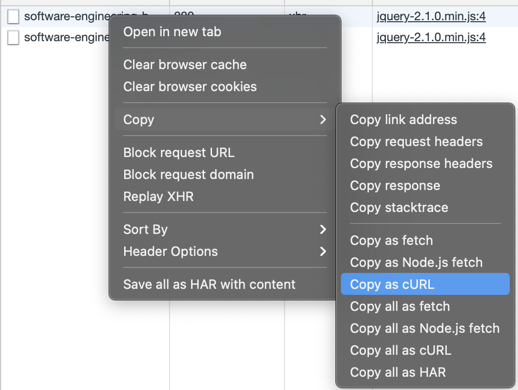

# software_engineering_basics_lab2_solver

## Installation

```shell
git clone https://github.com/foryourselfand/software_engineering_basics_lab2_solver.git
virtualenv venv
source venv/bin/activate
# venv\Scripts\activate.bat
pip install -r requirements.txt
```

## Usage

```shell
python solver.py --help

#usage: solver.py [-h] -v VARIANT -j JSESSIONID -p P_AUTH [-e]
#
#optional arguments:
#  -h, --help            show this help message and exit
#
#required named arguments:
#  -v VARIANT, --variant VARIANT
#                        variant number
#  -j JSESSIONID, --jsessionid JSESSIONID
#                        JSESSIONID from cookies
#  -p P_AUTH, --p_auth P_AUTH
#                        p_auth from params
#  -e, --extract_commits
#                        should solver also extract commits
``` 

## Examples

```shell
python solver.py --variant 134538 --jsessionid YcuD-TUVDbhlPjafeoIjO1RA1xlsgXAtiz_JxgAh.helios --p_auth HkW6wAwA --extract_commits
python solver.py --p_auth Supxz0z7 --jsessionid oeEJpf_6urlKNLWMTXjXQJjQUPTiWTCGvQ72-kfA.helios --variant 331039
# don't change jsessionid and p_auth every time, only if needed (stopped working, so needs update)  
```

## JSESSIONID? p_auth?

* go to https://se.ifmo.ru/courses/software-engineering-basics
* open network window in browser
* type variant and press enter
  
* choose first response, open headers window
* find and copy JSESSIONID from Cookie at Request Headers and p_auth from Query String Parameters
  
